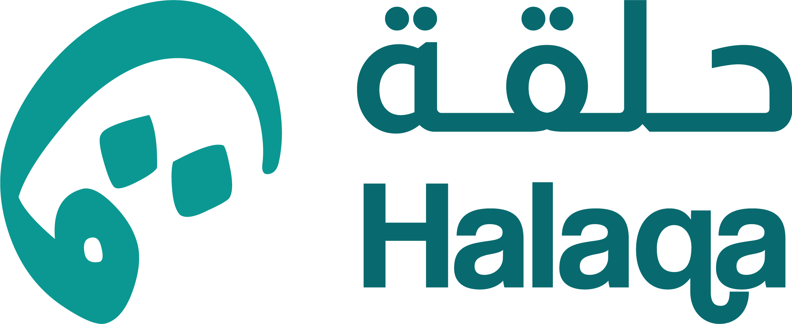

# 🌟 Halaqa Save - Decentralized Savings Groups Platform

<div align="center">



**Transform your savings journey with AI-powered community savings circles on the Internet Computer**

[](https://internetcomputer.org/)
[](https://www.rust-lang.org/)
[](https://reactjs.org/)
[](https://ai.google.dev/)

[📖 Documentation](#features) • [🎯 Features](#key-features) • [🛠️ Setup](#local-development)

</div>

---

## 🎯 What is Halaqa Save?

**Halaqa Save** is a revolutionary decentralized savings platform that combines traditional community savings circles (ROSCAs - Rotating Savings and Credit Associations) with cutting-edge Web3 technology and AI assistance. Built on the Internet Computer Protocol (ICP), it empowers users to create and join savings groups with transparent, automated, and secure fund management.

### 🌍 The Problem We Solve

- **Traditional savings** lack community support and motivation
- **Existing ROSCAs** suffer from trust issues and poor record-keeping  
- **Financial planning** is complex without expert guidance
- **Access to savings tools** is limited in underserved communities

### ✨ Our Solution

A **decentralized, transparent, and AI-enhanced** savings platform that:
- Combines the social benefits of traditional savings circles with blockchain security
- Provides **AI-powered financial recommendations** tailored to your goals
- Ensures **transparent fund management** through smart contracts
- Enables **global participation** without geographical limitations

---

## 🚀 Key Features

### 🤖 **AI-Powered Savings Advisor**
- **Google Gemini Integration**: Real-time financial advice via HTTP outcalls
- **Personalized Recommendations**: AI analyzes available groups and user goals
- **Intelligent Questioning**: Asks about budget, timeline, and savings objectives
- **Context-Aware Responses**: Understands group structures and payout mechanisms

### 🏛️ **Internet Computer Integration** 
- **Internet Identity**: Secure, passwordless authentication
- **Stable Storage**: Persistent data across canister upgrades
- **Canister Architecture**: Scalable backend built in Rust
- **On-Chain Governance**: Community-driven platform evolution

### 💰 **Smart Savings Groups**
- **Flexible Group Creation**: Custom duration, amount, and member limits
- **Dual Payout Systems**: 
  - **Auto Assignment**: Random slot allocation for fairness
  - **Manual Selection**: Choose your preferred payout month
- **Real-Time Tracking**: Monitor payments, cycles, and member status
- **Automated Payouts**: Smart contract-powered fund distribution

### 🎨 **Modern User Experience**
- **Responsive Design**: Works seamlessly on all devices
- **Dark/Light Mode**: Adaptive theming for user preference
- **Intuitive Navigation**: Clean, accessible interface
- **Real-Time Updates**: Live status updates and notifications

---

## 🏗️ Technical Architecture

### Backend (Rust Canister)
```
┌─────────────────────────┐
│     Frontend Assets      │ ← Static files served by IC
├─────────────────────────┤
│    Backend Canister     │ ← Core business logic in Rust
│  ┌─────────────────────┐│
│  │  User Management    ││ ← Internet Identity integration
│  │  Group Operations   ││ ← Create, join, manage groups
│  │  Payment Processing ││ ← Track contributions & payouts
│  │  Stable Storage     ││ ← Persistent data structures
│  └─────────────────────┘│
├─────────────────────────┤
│   External Services     │
│  ┌─────────────────────┐│
│  │  Google Gemini API  ││ ← AI recommendations via HTTP
│  │  ICRC-2 Token       ││ ← Future payment integration
│  └─────────────────────┘│
└─────────────────────────┘
```

### Frontend (React TypeScript)
```
Frontend/
├── src/
│   ├── components/          # Reusable UI components
│   │   ├── ui/             # shadcn/ui design system
│   │   ├── AIRecommendationChat.tsx  # AI chat widget
│   │   └── GroupDetailsModal.tsx     # Group interaction
│   ├── pages/              # Main application pages
│   │   ├── BrowseGroups.tsx    # Discover savings groups
│   │   ├── CreateGroup.tsx     # Create new groups
│   │   ├── Dashboard.tsx       # User overview
│   │   └── Profile.tsx         # User profile & history
│   ├── services/           # External integrations
│   │   ├── backend.ts          # ICP canister calls
│   │   └── geminiService.ts    # AI integration
│   ├── stores/             # State management (Zustand)
│   │   ├── useUserStore.ts     # User data & auth
│   │   └── useGroupsStore.ts   # Groups & memberships
│   └── types/              # TypeScript definitions
```

---

## 🛠️ Technology Stack

| Layer | Technology | Purpose |
|-------|------------|---------|
| **Blockchain** | Internet Computer Protocol | Decentralized hosting & computation |
| **Backend** | Rust + ic-cdk | Smart contract logic & data management |
| **Frontend** | React + TypeScript | Modern web application |
| **UI Framework** | Tailwind CSS + shadcn/ui | Responsive design system |
| **State Management** | Zustand | Efficient client-side state |
| **Authentication** | Internet Identity | Secure, passwordless login |
| **AI Integration** | Google Gemini API | Intelligent financial advice |
| **Storage** | IC Stable Structures | Persistent data across upgrades |

---

## 🤖 AI Integration Deep Dive

### HTTP Outcalls to Google Gemini

Our AI advisor uses **ICP's HTTP outcalls** capability to integrate with Google's Gemini API:

```typescript
class GeminiService {
  async getSavingsRecommendation(
    userMessage: string, 
    availableGroups: AvailableGroup[]
  ): Promise<string> {
    // Real-time API call to Google Gemini
    const prompt = `
      You are a professional savings advisor for Halaqa Save...
      Available Groups: ${this.formatGroupsForAI(availableGroups)}
      User Message: "${userMessage}"
    `;
    
    const result = await this.model.generateContent(prompt);
    return result.response.text();
  }
}
```

### AI Capabilities
- **Context Awareness**: Understands all available savings groups
- **Financial Expertise**: Provides advice on budgeting and goal-setting
- **Personalization**: Tailors recommendations to user's specific needs
- **Follow-up Questions**: Intelligently probes for more details
- **Multi-turn Conversations**: Maintains context across interactions

---

## 🚀 Local Development

### Prerequisites
- [Node.js](https://nodejs.org/) (v18+)
- [Rust](https://rustup.rs/) 
- [DFX SDK](https://internetcomputer.org/docs/current/developer-docs/setup/install/)
- [Git](https://git-scm.com/)

### Quick Start

```bash
# 1. Clone the repository
git clone https://github.com/yourusername/halaqa-save.git
cd halaqa-save

# 2. Install dependencies
cd Frontend && npm install

# 3. Start the IC replica
dfx start --background

# 4. Deploy canisters
dfx deploy

# 5. Set up AI integration (optional)
cd Frontend
echo "VITE_GEMINI_API_KEY=your_gemini_api_key" > .env

# 6. Start frontend development server
npm run dev
```

### Access Points
- **Frontend**: http://localhost:5173
- **Backend Candid UI**: http://localhost:4943/?canisterId={backend_canister_id}
- **Asset Canister**: http://localhost:4943/?canisterId={frontend_canister_id}

---

## 📊 Core Business Logic

### Group Lifecycle
```
1. Creation     → 2. Member Recruitment → 3. Active → 4. Completed
   ↓                    ↓                    ↓           ↓
[Pending]        [Accepting Members]    [Monthly      [Archived]
                                        Cycles]
```

### Payout Mechanisms

#### Auto Assignment
- System randomly assigns payout slots
- Ensures fairness and eliminates preference bias
- Ideal for equal opportunity groups

#### Manual Selection  
- Members choose their preferred payout month
- First-come, first-served slot allocation
- Perfect for users with specific financial goals

### Payment Flow
```
Monthly Contribution → Group Pool → Monthly Payout to Selected Member
     ↓                    ↓              ↓
Track Individual    Calculate Total   Update Member Status
    Balance           Available         & History
```

---

## 🔐 Security & Trust

### Internet Computer Security
- **Tamper-Proof**: Code runs on decentralized IC network
- **Transparent**: All transactions visible on-chain
- **Upgrade-Safe**: Stable storage preserves data across updates

### Internet Identity Integration
- **Passwordless**: No passwords to forget or compromise
- **Privacy-Focused**: Minimal personal data collection
- **Cross-Device**: Secure access from any device

### Smart Contract Safeguards
- **Automated Payouts**: Eliminates human error or bias
- **Member Verification**: Ensures only verified users can join
- **Payment Tracking**: Immutable record of all contributions

---

## 🎨 User Experience

### Responsive Design
- **Mobile-First**: Optimized for smartphone usage
- **Cross-Platform**: Consistent experience across devices
- **Accessibility**: WCAG compliant for inclusive design

### Intuitive Workflows
1. **Discovery**: Browse groups with AI recommendations
2. **Selection**: Compare options with detailed information
3. **Joining**: Simple slot selection and confirmation
4. **Monitoring**: Real-time dashboard and notifications
5. **Completion**: Transparent payout and history tracking

---

## 🌟 Competitive Advantages

| Feature | Traditional ROSCAs | Banking Products | Halaqa Save |
|---------|-------------------|------------------|-------------|
| **Trust** | Personal relationships | Institutional | Blockchain + Smart Contracts |
| **Transparency** | Limited | Moderate | Complete (on-chain) |
| **Accessibility** | Geographic limits | Credit requirements | Global, Internet Identity |
| **AI Guidance** | None | Limited | Personalized recommendations |
| **Flexibility** | High | Low | High + Automated |
| **Costs** | Social pressure | Fees & Interest | Minimal gas costs |

---

## 🔮 Future Roadmap

### Phase 1: Core Platform ✅ (Current)
- [x] Basic group creation and management
- [x] Internet Identity integration  
- [x] AI-powered recommendations
- [x] Responsive web interface

### Phase 2: Enhanced Features 🚧 (9/2025)
- [ ] ICRC-2 token integration for payments
- [ ] Mobile applications (iOS/Android)
- [ ] Advanced analytics and reporting
- [ ] Multi-language support

### Phase 3: Ecosystem Growth 🔮 (10/2025)
- [ ] DAO governance for platform decisions
- [ ] Integration with other IC dApps
- [ ] Advanced AI features (risk assessment)
- [ ] Community-driven group templates

---

## 🏆 Why This Matters for ICP

### Showcases ICP's Unique Capabilities
- **HTTP Outcalls**: Real-world AI integration
- **Internet Identity**: Passwordless Web3 UX
- **Stable Storage**: Persistent data without external dependencies
- **Asset Canisters**: Full-stack dApp on one platform

### Real-World Impact
- **Financial Inclusion**: Serves underbanked populations
- **Trust Building**: Demonstrates blockchain's transparency benefits
- **AI Integration**: Shows practical AI use cases in Web3
- **Global Accessibility**: Removes geographical banking barriers

---

## 📄 License

This project is licensed under the MIT License.
